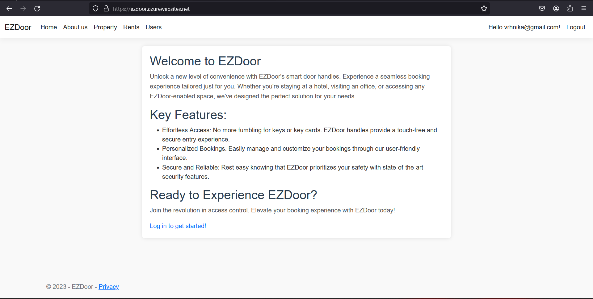
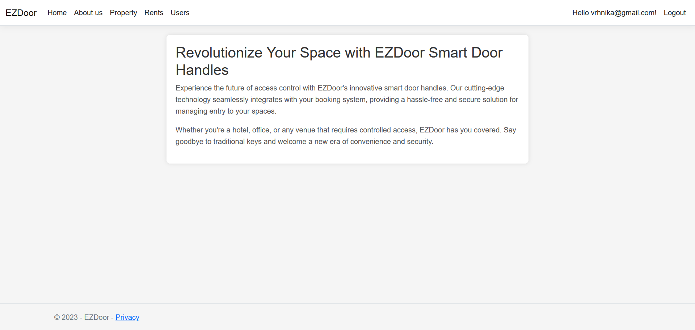
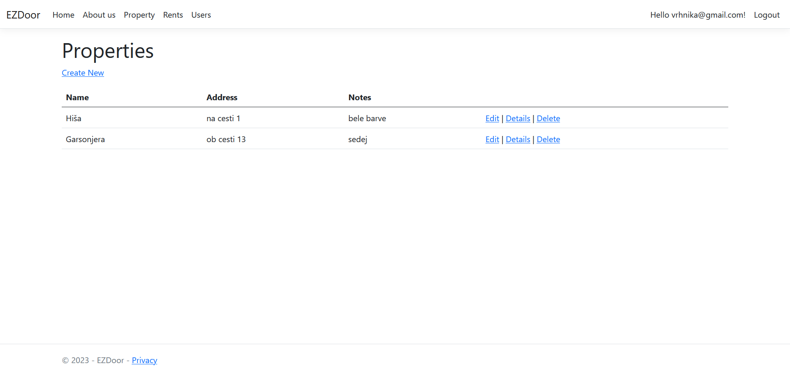
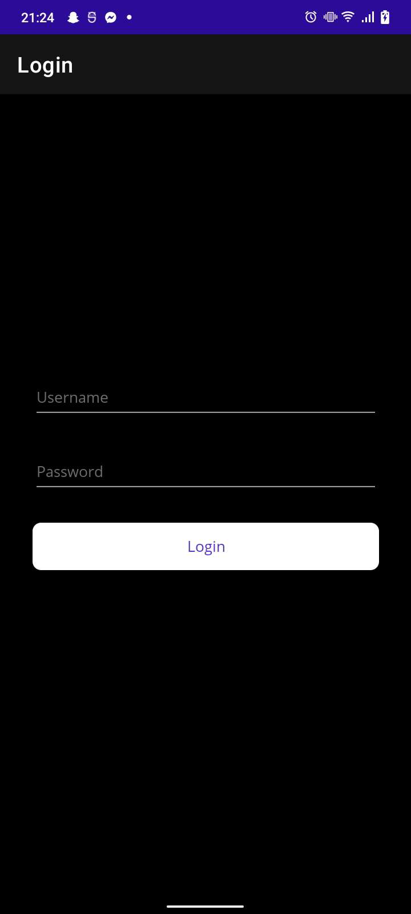
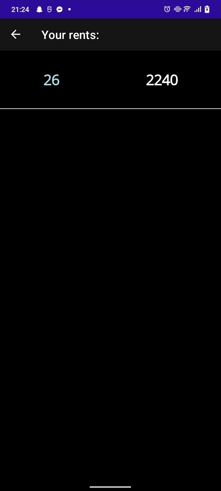
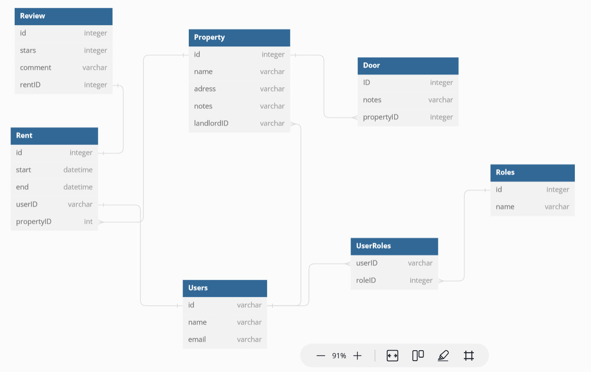

# EZDoor

## Avtorji:
Martin Sedej 63220289 \
Nejc Narobe 63220231 \
Tim Marinšek 63220455 \
Aljaž Škufca 63220316

## Opis:
Aplikacija je namenjena uporabnikom bookinga za oddajanje stanovanj, ki uporabljajo pametno ključavnico. Aplikacija omogoča dodajanje termina za oddajo in dostop do naključno generiranih kratkotrajnih klučev zadostop do objektov.

## Uporabnika za testeranje:
Za namen testiranja aplikacije lahko uporabite spodnje uporabnike ali pa kreirate svoje.
### Admin:
Ime: ```admin@ezdoor.si``` \
Geslo: ```Geslo123!```
### Najemnik:
Ime: ```najemnik@ezdoor.si``` \
Geslo: ```Geslo123!```
### Najemodajalec:
Ime: ```najemodajalec@ezdoor.si``` \
Geslo: ```Geslo123!```

## Github do esp32 kode:
https://github.com/necco13/EZdoorHandle
## Github do mobilne aplikacije:
https://github.com/necco13/EZDoorApp

## Zaslonske sike spletne aplikacije




## Zaslonske slike mobilne aplikacije



## Demonstracija
https://github.com/necco13/EZDoor/assets/42417423/58f55762-dc9f-4f54-a411-62a092b931ba

## Slika podatkovnega modela



